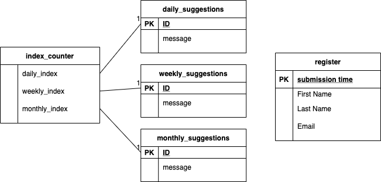

# CheckIn
This is for the Hack-it-out hackathon

[Hackathon Submission with video explanation](https://devpost.com/software/checkin-3629mw?ref_content=my-projects-tab&ref_feature=my_projects)

[Visit Our Site](https://joshbell9181.wixsite.com/checkin)

# About
We all have good intentions but actions speak louder than words. With CheckIn we send you reminders to do important daily tasks such as, "call someone you haven't talk to in a while" or "tell someone you love them". Not every message is going to apply to your situation however if you complete 90% of them we promise you will create, strengthen, and grow relationships in your life.

# Tech and APIs
- Wix API's
- npm nodemailer
- JavaScript
- github
- GMail

# Data Model

# future goals
We could extend comminucations to
- twilio texting APIs
- Google home
- Alexa
